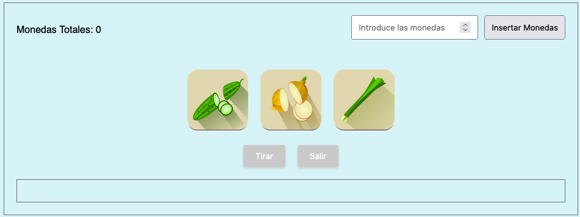

# Tragaperras-JS
Máquina tragaperras utilizando JavaScript

## Posibles combinaciones

* 1 zanahoria -> ganar 1 moneda
* 2 zanahoria -> ganar 4 monedas
* 3 zanahoria -> ganar 10 monedas
* 2 verduras iguales (no zanahoria) --> ganar 2 monedas
* 3 verduras iguales(no zanahoria) --> ganar 5 monedas
* 1 zanahoria + 2 verduras iguales --> ganar 3 monedas

